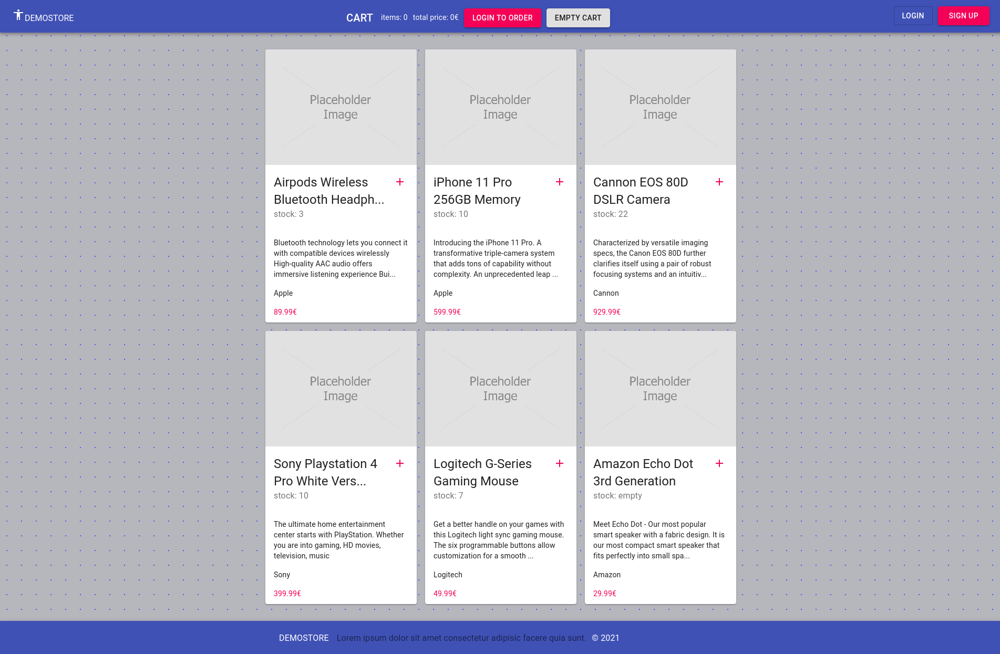

# express-demo-store

 

Express RESTful API with basic authentication via JWT local storage, mongoose and react.

- deployment: https://express-demo-store.herokuapp.com

 

 

## Installation

1.  Run `npm i` to install dependencies on server and client or run `npm run fresh`

1.  Create config `.env` file under root folder as described in the example.

1.  Seed database with Users, Products and Orders: `npm run DATA:import`

 

##### .env example

    NODE_ENV=development

    PORT=5000

    MONGO_URI=mongodb://localhost:27017/express-demo-store

    JWT_SECRET=289f52c34d7af6a4aadadeb58641b60c9246077c6aa0ff1d

## Start

Run server and client separately.

    npm run server

    npm run client

##### Sample users

    admin@user.com [Admin]
    12345678

    user1@email.com [Customer]
    12345678

 

API is documented with Postman, the collection is located under root folder as: `express-demo-store API.postman_collection.json`

 

 

 

 

Enjoy !
